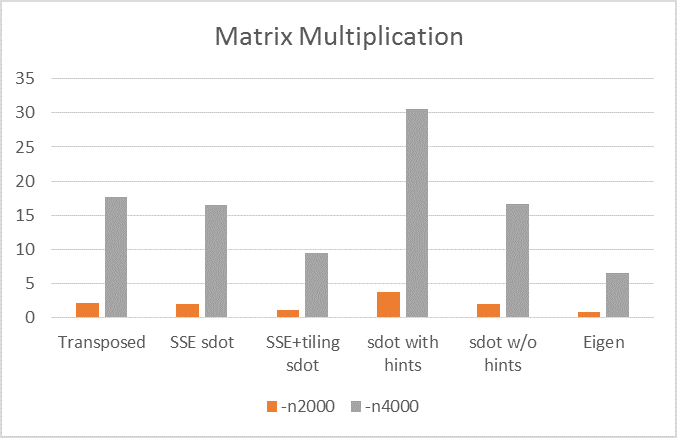

This repo evaluates different matrix multiplication implementations given two
large square matrices (2000-by-2000 in the following example):

|Implementation |Long description|
|:--------------|:---------------|
|Naive          |Most obvious implementation|
|Transposed     |Transposing the second matrix for cache efficiency|
|sdot w/o hints |Replacing the inner loop with [BLAS sdot()][sdot]|
|sdot with hints|sdot() with a bit unrolled loop|
|SSE sdot       |vectorized sdot() with explicit SSE instructions|
|SSE+tiling sdot|SSE sdot() with [loop tiling][looptile]|
|Eigen |[Eigen][eigen]|

Here is the result on my machine (Y axis is seconds, lower is better):

The -a0 is too slow, that's why not on the diagram.

The PC configuration is Core i5-4460, 16GB RAM, Windows 10 Pro.
The compiler is Visual Studio 2015 Update 3.

Two differences from Linux/GCC were interesting.

1. Note how hints (=manual loop unrolling) ruined the performance: Visual C++ compiler did much better job without them.
1. Looks like generally, Microsoft’s optimizer is better. On Linux/GCC, manually optimized Eigen is 2 times faster than the best custom implementation, SSE+tiling sdot. On Windows/Visual C++, the difference is 30-40%. 

[looptile]: https://en.wikipedia.org/wiki/Loop_tiling
[eigen]: http://eigen.tuxfamily.org/index.php?title=Main_Page

